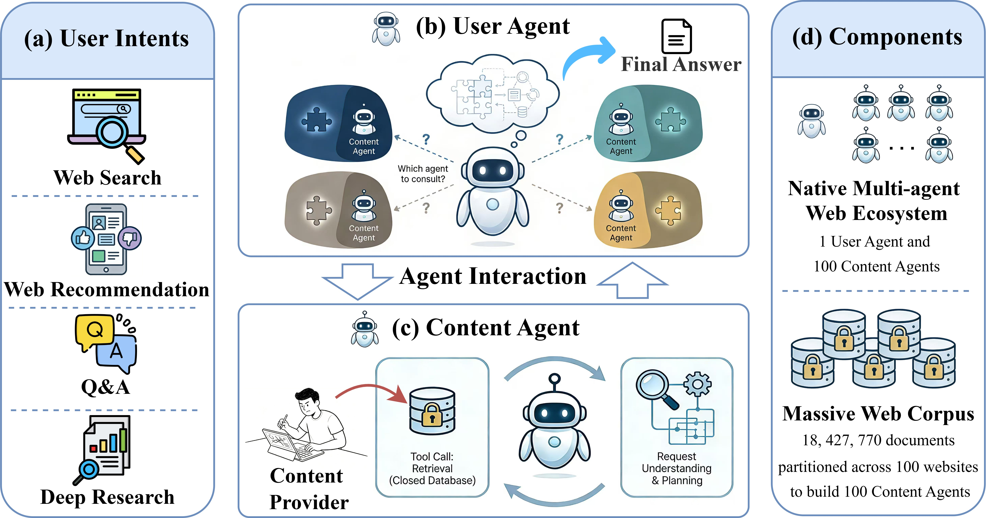

<div align="center">

# AgentWebBench

[](https://cxcscmu.github.io/AgentWebBench)
[](https://arxiv.org/pdf/2604.10938)
[](#-tasks)
[](#-websites)
[](#-documents)
[](LICENSE)



<strong>A benchmark for Multi-Agent Coordination in the Agentic Web.</strong>

</div>

**Agentic Web** is an emerging paradigm where autonomous agents help users use online information. As the paradigm develops, content providers are also deploying agents to manage their data and serve it through controlled interfaces. This shift moves information access from centralized retrieval to decentralized coordination. To study this setting, we introduce **AgentWebBench**, a benchmark that evaluates how well a **user agent** synthesizes answers by interacting with website-specific **content agents**. 

## News

- 🔥 **[2026-06-16]**: We released our code and datasets, check out [our leaderboard](https://cxcscmu.github.io/AgentWebBench/leaderboard.html)!
- 🔥 **[2026-05-01]**: Cheers! Our paper was accepted to [ICML 2026](https://icml.cc/virtual/2026/poster/63068)!
- 🔥 **[2026-04-13]**: Our paper is now available on [arXiv](https://arxiv.org/pdf/2604.10938). Check it out!


## Installation

**(1) Environment**

```bash
conda create -n awbench python=3.12
conda activate awbench
pip install -r requirements.txt # CUDA 12.9
```


**(2) API keys**

Put your secrets in `keys.env` at the repo root:

```bash
# Google API Key (Gemini)
# Get from: https://ai.google.dev/
GOOGLE_API_KEY=your_google_api_key_here

# OpenAI API Key (GPT models)
# Get from: https://platform.openai.com/api-keys
OPENAI_API_KEY=your_openai_api_key_here

# Hugging Face Token (for model access)
# Get from: https://huggingface.co/settings/tokens
HF_TOKEN=your_huggingface_token_here
```
**(3) Verify Search API Status**

We provide a Search API for all tasks. To check the API status, run the following commands:
```
curl "https://www.clueweb22.us/awbench/websites"
```
These vectors and ID maps are derived from ClueWeb22 documents. Use is subject to the [ClueWeb22 license](https://lemurproject.org/clueweb22/).


## Benchmark Design

### 🧩 Tasks

AgentWebBench has **four tasks** that cover common web information needs:

- **Ranked retrieval** — web search, web recommendation.
- **Open-ended synthesis** — question answering, deep research.

| Task | `--task_type` | Dataset | # | Description | Metrics |
|------|---------------|---------|---|-------------|---------|
| Web Search          | `web_search`         | [data/web_search/test_354.json](data/web_search/test_354.json)         | 354 | Document-retrieval queries     | NDCG@{3,5}, Recall@{3,5} |
| Web Recommendation  | `web_recommendation` | [data/web_recommendation/test_281.json](data/web_recommendation/test_281.json) | 281 | Browsing history → next intent | NDCG@{3,5}, Recall@{3,5} |
| Question Answering  | `qa`                 | [data/qa/test_53.json](data/qa/test_53.json)                  | 53  | Multi-hop QA                   | Accuracy, F1 |
| Deep Research       | `deep_research`      | [data/deep_research/test_331.json](data/deep_research/test_331.json)      | 331 | Deep Research questions                | KPR, KPC, Clarify, Insight |

Each task also ships a `test_1.json` single-example smoke set. 


### 🧩 Methods

The `--method` flag sets how the user agent coordinates content agents:

| `--method`     | Name             | What it does |
|----------------|------------------|--------------|
| `classical`    | Classical        | User agent only; centralized search directly over the global corpus. |
| `tool_embed`   | Tool<sub>E</sub> | User agent only; websites are exposed as tools and selected by **embedding** similarity. |
| `tool_prompt`  | Tool<sub>P</sub> | User agent only; websites are exposed as tools and selected by **prompt** (the user agent picks the sites). |
| `multi_agent`  | Multi-Agent      | The user agent dispatches to per-website content agents that search and summarize in parallel. |

Our search API supports per-site search. If you need traditional centralized search (`classical`), you may use the global embeddings available at [AgentWebBench-corpus](https://huggingface.co/datasets/cx-cmu/AgentWebBench-corpus/tree/main) and download [ClueWeb22 category B](https://lemurproject.org/clueweb22/index.php).

## Quick Start

Run all commands from the repo root.

```bash
# --- Hosted API model ---
sh scripts/run_qa.sh             multi_agent gemini gemini-3-flash-preview
sh scripts/run_web_search.sh     multi_agent gpt    gpt-4o
sh scripts/run_deep_research.sh  multi_agent hf     Qwen/Qwen3-30B-A3B-Thinking-2507:nebius

# --- Local model via vLLM (random port) ---
sh scripts/launchers/run_works_local_4b.sh
```

Each command runs `main.py` and then its evaluation. The repo supports four LLM
backends (`--api_type ∈ {gemini, gpt, hf, local}`):

- [Gemini](https://ai.google.dev/gemini-api/docs/models)
- [GPT](https://developers.openai.com/api/docs/models)
- [HuggingFace Inference](https://huggingface.co/inference/models)
- Local models served with vLLM

See [`scripts/README.md`](scripts/README.md) for details.


## How to evaluate a new LLM or method?

Existing results are on the [Homepage](https://cxcscmu.github.io/AgentWebBench) and in the [Paper](https://arxiv.org/pdf/2604.10938). If you want to evaluate other LLMs or coordination strategies,

- **New LLM** — serve your model with vLLM and run with `--api_type local`.
- **New coordination strategy** — modify the [user agent](awbench/agents/user_agent.py) or [content agent](awbench/agents/content_agent.py).


## Acknowledgements

Our work is built on [ClueWeb22](https://lemurproject.org/clueweb22/),
[Tevatron](https://github.com/texttron/tevatron),
[MiniCPM-Embedding-Light](https://huggingface.co/openbmb/MiniCPM-Embedding-Light),
and the [MS MARCO](https://microsoft.github.io/msmarco/) / [DeepResearchGym](https://www.deepresearchgym.ai/) / [ORBIT](https://www.open-reco-bench.ai/) datasets.


## Citation

```bibtex
@inproceedings{zhong2026agentwebbench,
  title={AgentWebBench: Benchmarking Multi-Agent Coordination in Agentic Web},
  author={Zhong, Shanshan and Shen, Kate and Xiong, Chenyan},
  booktitle={Proceedings of the 43rd International Conference on Machine Learning (ICML)},
  year={2026}
}
```
